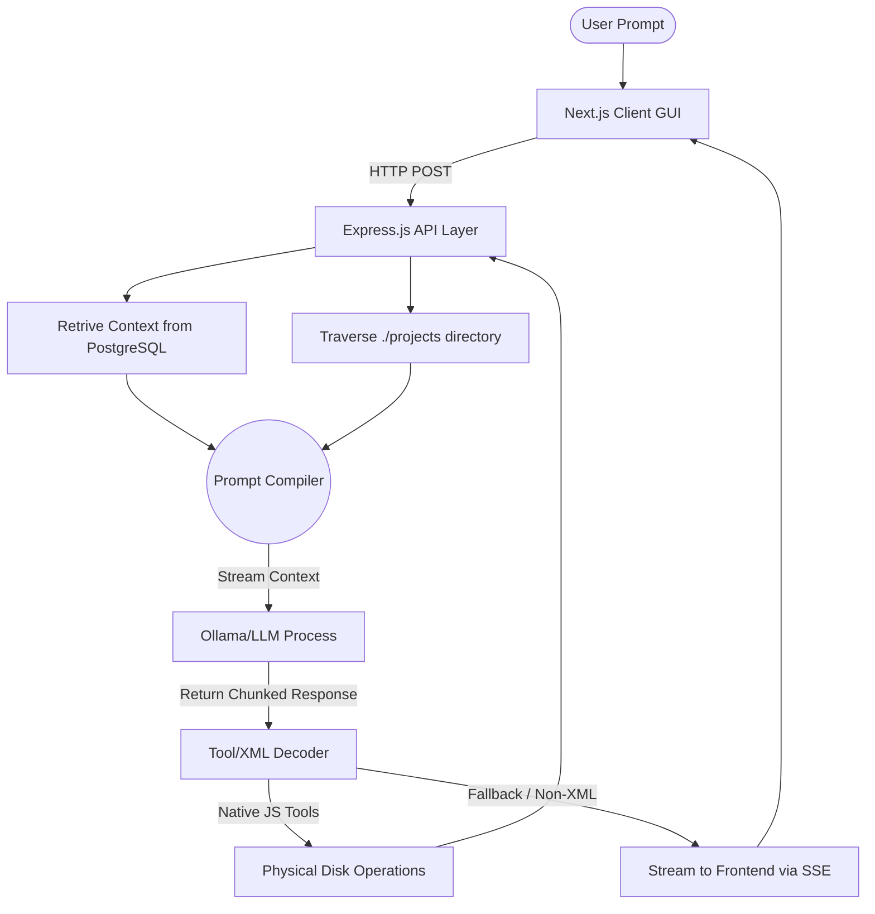

# Akili AI Factory - Comprehensive Project Documentation

## Table of Contents
1. [Executive Summary](#1-executive-summary)
2. [Architectural Overview](#2-architectural-overview)
3. [Technology Stack](#3-technology-stack)
4. [File System Directory Structure](#4-file-system-directory-structure)
5. [Database Architecture](#5-database-architecture)
6. [Backend Operations (Orchestrator)](#6-backend-operations-orchestrator)
    - 6.1 Server Initialization & Database Connections
    - 6.2 Pre-warming and Local Compute
    - 6.3 Core REST Endpoints
    - 6.4 The LLM Inference Pipeline
    - 6.5 Prompt Engineering & Phases
7. [The Tool Execution Engine](#7-the-tool-execution-engine)
    - 7.1 XML Tool Parsing Mechanism
    - 7.2 File System Toolkit (`src/tools/files.js`)
    - 7.3 Shell Execution Toolkit (`src/tools/terminal.js`)
8. [Frontend Layer (Next.js Application)](#8-frontend-layer-nextjs-application)
    - 8.1 Landing Page (`page.tsx`)
    - 8.2 Project Workspace & Editor (`app/project/[id]/page.tsx`)
    - 8.3 Context Handling & Stream Parsing
    - 8.4 Live Rendering Sandbox (Sandpack)
9. [Networking & Containerization](#9-networking--containerization)
    - 9.1 API Routes and CORS
    - 9.2 Docker Compose Configurations
10. [Debugging & Analytics](#10-debugging--analytics)
11. [Roadmap & Maintenance Guidelines](#11-roadmap--maintenance-guidelines)

---

## 1. Executive Summary

Akili is a state-of-the-art AI-powered software generation platform designed specifically for rapid web prototyping. By acting as a conversational "virtual developer," users interact with the system via natural language. Akili then evaluates requirements, writes production-ready code (employing Tailwind CSS, JavaScript, and HTML), and physically executes deployment constraints within sandboxed project envelopes.

The UI concurrently monitors the exact disk-state of the user's files and renders them live via a virtualized web-bundler (Sandpack), resulting in real-time visual results matching the code that the LLM generates under the hood.

---

## 2. Architectural Overview

At its core, the ecosystem is built upon an autonomous, reactive loop:



1. **Client Interaction:** The frontend sends a user message.
2. **Contextual Hydration:** The backend loads database history and file structures.
3. **Inference Execution:** The payload is injected into a local LLM via Ollama (defaulting to `qwen3-coder-next:cloud` on `localhost`).
4. **Tool Activation:** The LLM outputs strict XML representations of Vanilla JS software development tasks.
5. **Physical Realization:** The backend executes the logic, overwriting actual host files.
6. **Live Render:** The changes are pushed instantly to the user's live browser Sandbox.

---

## 3. Technology Stack

### Application Tiers
- **Frontend Framework:** Next.js 16 (App Router), React 19.
- **Frontend Styling:** Tailwind CSS v4, Radix UI Primitives, Lucide-React.
- **Frontend Sandbox Compiler:** `@codesandbox/sandpack-react`.
- **Backend Environment:** Node.js (v20+ target), Express.js (v5.1).
- **Backend Database:** PostgreSQL 15.
- **Backend LLM Middleware:** Fetch API streaming, explicit Ollama REST protocols.
- **Containerization:** Docker, `docker-compose`.

---

## 4. File System Directory Structure

The repository is modular and segregates visual application tiers, operational tooling, and database assets.

```text
/ai-factory/
├── .env                       # Environment configs.
├── .env.docker                # Environment variables used in Docker execution.
├── DOCKER.md                  # Instructions for spinning up infrastructures.
├── docker-compose.yml         # Container mapping protocols and networks.
├── Dockerfile                 # Image blueprint for the Express Backend.
├── init-db.sql                # SQL initialization map.
├── package.json               # Backend dependency blueprint.
│
├── src/                       # >>> BACKEND DIRECTORY <<<
│   ├── server.js              # Core API Server & Endpoint definition.
│   ├── db.js                  # Global pg.Pool database connector module.
│   ├── llm.js                 # [DEPRECATED] Legacy React fetch wrapper (inactive).
│   └── tools/                 # Explicit tool logic exported to LLM bounds.
│       ├── index.js           # Tool schema definitions & module combiners.
│       ├── files.js           # Physical Node.js `fs` manipulation logic.
│       └── terminal.js        # `execa` terminal command running wrappers.
│
├── frontend/                  # >>> FRONTEND DIRECTORY <<<
│   ├── package.json           # Next.js configurations & dependencies.
│   ├── tailwind.config.ts     # UI aesthetic rules & breakpoints.
│   ├── app/                   # Next.js routing domains.
│   │   ├── layout.tsx         # Global context & DOM root layout.
│   │   ├── page.tsx           # Dashboard / Homepage project display.
│   │   └── project/
│   │       └── [id]/
│   │           └── page.tsx   # Workspace UI logic (Sandpack & Chat arrays).
│   ├── components/            # Shared UI entities (Radix Dialogs, Buttons).
│   └── public/                # Static assets.
│
└── projects/                  # >>> WORKSPACE DIRECTORY <<<
    ├── 1/                     # Hosted workspace instances mapped to chat records.
    │   ├── index.html
    │   └── script.js
    └── ...
```

---

## 5. Database Architecture

The data layout is deeply normalized, revolving strictly around an event-sourcing paradigm where `chats` store the project domain, and `messages` represent historical event logs.

### 5.1 Tables

#### 1. `chats` Table
Used to isolate specific applications and user instances. Currently, `project_id` and `chats` effectively bind 1-to-1 semantics.
*   `id` (SERIAL PRIMARY KEY): Numeric ID assigned to a user workspace. Maps physically to `projects/[id]/`.
*   `title` (TEXT): The dynamically inferred display title (e.g. "Bumping NextJS to v15").
*   `created_at` (TIMESTAMP): Standard audit timestamp.

#### 2. `messages` Table
The entire communication backbone.
*   `id` (SERIAL PRIMARY KEY)
*   `chat_id` (INTEGER, FK -> chats(id)): Links context.
*   `role` (TEXT): Discriminator marking who authored the event. Strictly: `user` or `assistant`. (System contexts are interpolated dynamically).
*   `content` (TEXT): Markdown contents, code templates, or historical tool outputs mapping.
*   `created_at` (TIMESTAMP)

#### 3. `projects` Table
Holds overarching workspace states or conceptual models.
*   `id` (SERIAL PRIMARY KEY)
*   `name` (TEXT)
*   `prompt` (TEXT)
*   `content` (TEXT)
*   `created_at` (TIMESTAMP)

### 5.2 Performance Indexes
Data querying relies heavily on context loading. Indexes optimize these heavy selections:
`idx_messages_chat_id`, `idx_chats_project_id`, `idx_projects_created_at`, `idx_chats_created_at`.

---

## 6. Backend Operations (Orchestrator)

The main core of Akili rests in `src/server.js`.

### 6.1 Initialization
The application first launches a generic connection to PostgreSQL by calling `pool.connect()` asynchronously. Upon success, it immediately initiates a `warmModel()` hook.

### 6.2 Pre-warming and Local Compute
`warmModel()` fires an invisible API `/api/generate` command containing the prompt `"hi"`. By demanding a fast, small inference, Ollama allocates the massive gigabyte parameter tensors of the target LLM into GPU Virtual RAM. VRAM allocation often takes 15+ seconds out of idle logic; by doing this eagerly on boot, user interactions begin with virtually instantaneous inference speed. It forces a `keep_alive` override of 2 hours.

### 6.3 Core API Endpoints

*   **`GET /api/chats`**
    Retrieves the chronological list of previously managed workspaces to populate the Next.js `LandingPage` dashboard.
*   **`POST /api/chats`**
    Mints a fresh `chat` row and effectively initiates a disk namespace payload.
*   **`GET /api/projects/:id/files`**
    Executes an internal tool lookup (`tools.getFileTree`) traversing directory `projects/:id`. It returns an N-ary tree containing recursive nested arrays documenting `file` and `directory` mappings.
*   **`GET /api/projects/:id/files/*`**
    Wildcard route utilizing path extraction to bypass standard Express constraints, allowing read commands deeper into arbitrary folder nestings. Exposes direct read access to `readFile()`.

### 6.4 The Inference Pipeline (`POST /api/chats/:id/messages`)
This is the most critical pipeline within the platform.
1.  **Ingestion:** Receives the user prompt string via HTTP body.
2.  **State Save:** Logs the message against the active `chat_id`.
3.  **Recursion Loop Initiation**: Since LLMs can sometimes fail or require multi-step tool calls, the API enters a `while (loopCount < MAX_LOOPS)` state (bounded to 5 to protect from infinite loops).
4.  **Database Concatenation & TTFT Stripping**: Extracts the last 4 historical rows. A specialized Regular Expression (`/<content>[\s\S]*?<\/content>/g`) physically strips old code outputs from the memory log. This prevents massive Time-To-First-Token latencies and GPU crashes when pinging local models.
5.  **Workspace Manifest Serialization**: A specialized hook scans the host directory and builds a string `[System Data: Current files in workspace: index.html, ...]` so the agent mathematically knows where it can edit.
6.  **Streaming Socket Injection**: `headers Sent` configuration is flipped into `chunked` HTTP transfer semantics.
7.  **Decoder Engine**: Reads Uint8 arrays from Ollama. Reassembles strings and searches via Regex for XML boundary blocks (`<tool name="...">...</tool>`).
8.  **Internal Rerouting**: If a tool block executes correctly, it triggers `executeToolCall()`, injects the result into the DB, and continues the logic loop silently without terminating the user stream payload entirely.

### 6.5 Prompt Environments & Phases
Depending on the history depth, different AI personas trigger:
-   **Phase 1 Prompt**: (Inception Stage). The user states a raw generic idea. The agent is strictly commanded to refuse writing code and forced to ask clarification prompts.
-   **Phase 2 Prompt**: (Developer Stage). Injected with highly tailored, modern layout metrics. Adhering to neutral slate/zinc aesthetics, high margins, and strict glassmorphic CSS rules.

---

## 7. The Tool Execution Engine

Located inside `src/tools/index.js`, tools are explicit Javascript promises acting as the AI's "hands."

### 7.1 XML Sub-Routine Parser
In `server.js`, `parseToolCalls()` utilizes the following strict Regex matrix:
```regex
/<tool name="(\w+)">([\s\S]*?)(?:<\/tool>|$)/g
```
It extracts the encapsulated metadata and constructs dynamically formed JSON objects matching documented schema constraints.

### 7.2 File Interactions (`files.js`)
*   **`createFile(projectId, filePath, content)`**: Uses standard `fs.writeFileSync`. It guarantees directory nesting constructs utilizing `<mkdirp>`-like polyfills to prevent "Directory not Found" race conditions.
*   **`updateFile()`**: Identical logic flow as creation, structurally bypassing traditional partial diffs in favor of fully formed layout mappings.
*   **`getFileTree()`**: Recurses into nodes mapping internal state dictionaries. Bypasses nested hidden directories to prevent IDE noise.

### 7.3 Shell Actions (`terminal.js`)
*   **`runCommand(projectId, command)`**: A severely restrictive implementation enforcing `execa` node modules bounded inside the explicit `cwd` parameter (`/projects/[id]`). It limits outputs from malicious destruction by restricting core system access binaries.

---

## 8. Frontend Layer (Next.js Application)

Constructed using the NextJS 16 framework combining server components with deep `use client` states.

### 8.1 Landing / Dashboard (`app/page.tsx`)
A stylized command center utilizing Radix primitives and lucide-react. Fetches API lists and parses previous workspace components utilizing grid cards with interactive hover effects and metadata mapping.

### 8.2 The WorkStation (`app/project/[id]/page.tsx`)
The WorkStation breaks the DOM into three massive columns: Code Explorer, Real-time Visualizer, and Chat Log.
-   **Chat Log**: Renders messages mapping via `react-markdown` executing GFM markdown parsers over the continuous `accumulated` byte-stream string.
-   **Toolbar Navigational Elements**: Embellishes states managing `activeTab` states switching DOM opacity and Z-index values visually routing the user between Editor configurations.

### 8.3 Context Handling & Stream Parsing
The UI employs complex hooks to extract XML boundaries in-flight.
-   As chunks stream via the `TextDecoder()`, `messages[n]` arrays are altered. This triggers `useEffect` evaluations.
-   The stream checks for the `createFile` substring structures and simultaneously builds `virtualFiles`.
-   The frontend has independent capability to inject `.js` extensions directly into strings to protect compilation flows if the LLM output is structurally missing extensions (`frontend/app/project/[id]/page.tsx:136`).

### 8.4 Sandpack Engine Pipeline
The `SandpackProvider` is a massive internal component that provides a virtualized bundler inside an iframe.
*   **`template="vanilla"`**: Deploys an unopinionated baseline sandbox layout.
*   **`externalResources`**: Tailwind CDN paths are explicitly configured here, ensuring styles resolve securely and bypass iframe hot-module blocking errors.
*   **`baseSandpackFiles`**: Mocks the root `/index.js` dependency to route seamlessly into `script.js` forcing execution paradigms to conform to traditional HTML DOM structures rather than modern bundler injection rules.

---

## 9. Networking & Containerization

### 9.1 Express.js Configuration
-   Uses generic `cors({ origin: '*' })` internally for rapid expansion flexibility.
-   Runs inherently on port `4000`.

### 9.2 Docker Compose Structures
Rests securely inside `docker-compose.yml`:
-   **`postgres:15-alpine`**: Slimmed Database mapped volume instances caching state (`/var/lib/postgresql/data`).
-   **`backend`**: Node instance container configured via `.env` parameter mappings linking `LLM_MODEL` strings explicitly into backend API endpoints.

---

## 10. System Optimizations & Anti-Pattern Reductions

Several deep optimizations safeguard Akili against collapse and extreme latency:
1.  **State Throttling & Macro-Task Yielding:** Rapid text chunks streaming natively from `localhost` resolve instantly, buffering deeply inside the micro-task queue. To prevent React from hitting "Maximum Update Depth" crashes during massive renders, the `Date.now() > 50` chunk reader injects `await new Promise(r => setTimeout(r, 0))` to explicitly yield to the browser's macro-task event loop, flushing state commits properly.
2.  **Context History Chunking & Memory Stripping:** Deeply nested conversational lengths suffer massive Time-To-First-Token memory latencies. `src/server.js` selectively truncates message logs passing solely the final `4` interactions, while stripping physical `<content>` payload blocks entirely from memory preventing total context bloat securely.
3.  **Compilation Monitoring Loop**: `SandpackAutoFixer` operates silently as an `ErrorEvent` watcher inside the internal bundler. Utilizing `setTimeout`, upon a syntax crash, it extracts the stacktrace text strings, maps it silently against the backend API endpoint recursively feeding the error state into the LLM system until the error completely vanishes.

---

## 11. Security Domains & Architectural Limitations

-   **Execution Escapes:** `runCommand` tools are artificially throttled currently to purely read configurations to circumvent arbitrary file wiping commands.
-   **Token Output Cutoffs:** Massive 15,000+ token limits are supported, however generating excessively long files (800+ lines HTML structures) runs exponential risks of JSON formatting string crashes.
-   **Cross Site Vectors:** Internal execution domains assume local authorization logic over public deployments. If scaling openly, `/api/chats` routes must authenticate logic layers protecting raw shell execution configurations inherently deployed.

---

## 12. Future Iterations & Implementation Roadmaps

1. **Ast Parser & Diff-Based File Editing:** Implement internal AST (Abstract Syntax Trees) algorithms routing differential logic updates utilizing `<tool name="editFile">` over complete overwrite methodologies, improving response speeds 1000%.
2. **Framework Integration Options:** Injecting explicit Next.js or Vite React router models via pre-defined Sandpack execution packages allowing Akili to map actual functional Full-Stack interactions natively.
3. **Persisted Disk Deployments:** Expand frontend architecture with explicit Github connection tooling allowing internal zip-bundling and auto-commit APIs allowing deployment directly to external CI/CD pipelines effortlessly.
4. **Knowledge Retrieval Plugins:** Extend `llm.js` structures allowing vector database queries on design system tokens routing arbitrary knowledge injections automatically preventing contextual token overflows entirely.
